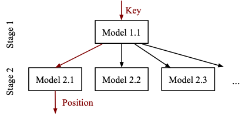
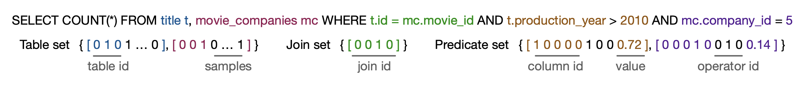
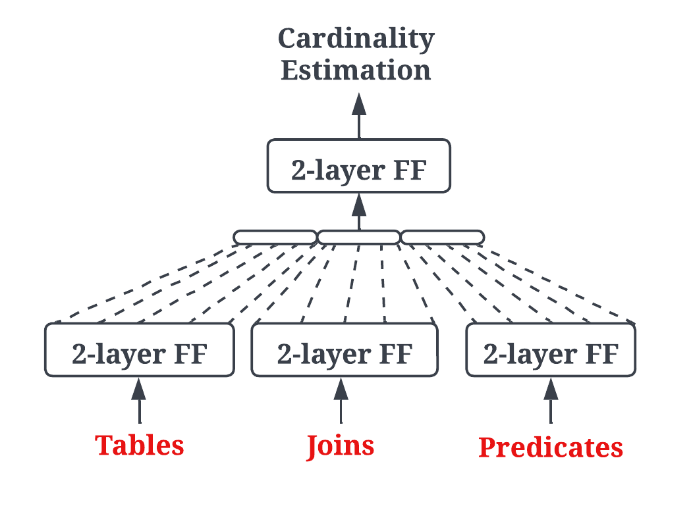
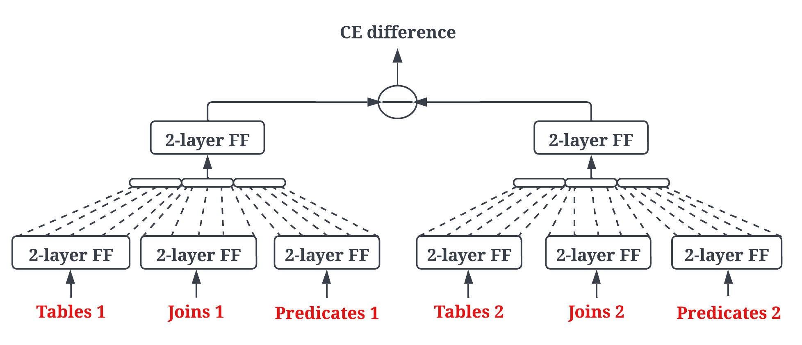

# Characterizing Neural Network Verification for Systems with NN4SysBench
We propose a new set of benchmarks for neural network verification for systems (NN4Sys) in this repository. This suite includes verification benchmark for learned index and learned cardinality, which are two tasks that apply neural networks to solve traditional tasks for systems. 

## Learned Index

### Background
Below we introduce the first learned index using neural networks, named Recursive Model Index (RMI), which is depicted as:

 
RMI has multiple stages and each stage has one or multiple models. During a lookup, RMI picks one model in each stage to run; models in upper stages (starting from stage 1) decide the model in the next stage; and a final stage model predicts the data position for the queried key.

### Specifications
Specifications for learned index require that the neural networks predict with bounded errors for all keys (including non-existing keys). This applies to range queries whose upper/lower bound of the range might be non-existing keys.In particular, one specification entry reads as follows,

> $\forall k \in [\mathcal{K}[i], \mathcal{K}[i+1]]$,
> $F(k) \in [DB(\mathcal{K}[i])-\epsilon, DB(\mathcal{K}[i+1])+\epsilon]$

where $k$ is a key, $\mathcal{K}$ is the sorted list of existing keys, $F(\cdot)$ is the learned index, $DB$ is the database key-position mapping (ground truth), and $\epsilon$ is the error bound. The number of specification entries equals the number of keys in the database.

### Model Details
we train a single neural network for learned index benchmark, which
is much more expensive than RMIs. In particular, we borrow training approaches from Ouroboros to train a single neural network that learns very well in a 150K-key lognormal dataset. Models in [model](./model) in our benchmark has two learned index sizes: 2) a four-layer fully connected network with 128 neurons each layer, 2) a six-layer network with width of 128.

## Learned Cardinality

### Background

Cardinality estimation aims at estimating the size of sub-plans of each query and guiding the optimizer to select the optimal join operations. Performance of cardinality estimation has great impact on the quality of the generated query plans. Recent works have explored how machine learning can be adopted into cardinality estimation. [This paper](https://arxiv.org/pdf/1809.00677.pdf) proposes a multi-set MLP-based architecture (MSCN) to frame the cardinality estimation problem as a typical deep learning task.  Despite the promising results, learned cardinality has a drawback that it neglacts the internal semantic logic of each query as a result of encoding queries into numerical vectors.

### Specifications

Our specifications are designed following the intuition of verifying internal semantics of the cardinality estimation task. For example, if we have Table $t$ and query $q$, a naive property can be

> $0\leq Cardinality(q)\leq $#total samples of $t$.

We construct specifications with more advanced properties combining task semantics and verification requirements. Besides, to verify the consistency (monotonicity) of model predictions, we also design monotonicity specifications for example:

> $q_1$=SELECT COUNT(*) FROM title t WHERE t.prod_year>2015
>
> $q_2$=SELECT COUNT(*) FROM title t WHERE t.prod_year>2020
>
> $Cardinality(q_1) \geq Cardinality(q_2)$

### Model Details

We leverage the settings for the original MSCN except for not using a bitmap in our input. Excluding the bitmap makes the MSCN model flexible to various query inputs and largely reduce the model size.  Every query is featurized as a vector:

where binary values stand for one-hot encoding of tables, joins, and queries present in the query. And the numerical values such as 0.72 in the figure is the normalized attribute value. 
The featurized query is further fed into a multi-set MLP-based model:

To enable monotonicity verification for today's tools, we duplicate the trained MSCN model and connect the two models side-by-side as a single new model, called a dual-model:

 

The dual-model's inputs and outputs are doubled compared to the original MSCN. We use a split operator to split inputs into two and send them to the two identical 'internal models': the first half of the inputs go to the first model and the second half to the second model. Dual-model's output is the difference between the estimated cardinality for the first-half inputs, and the second-half inputs. 
In directory [model](./model), we provide four trained networks with hidden size as 128 and 2048 for both single model and dual model settings.
## Verification Instructions
Automatically generated specifications that may include multiple instances in one vnnlib file can be found in directory [spec](./spec). 
Our benchmark provides pairs of (i) models for learned index and learned cardinality, (ii) corresponding specifications, (iii) corresponding timeout to cover varied difficulties for verification tools. You can find these information in [nn4sys.csv](./nn4sys.csv).
